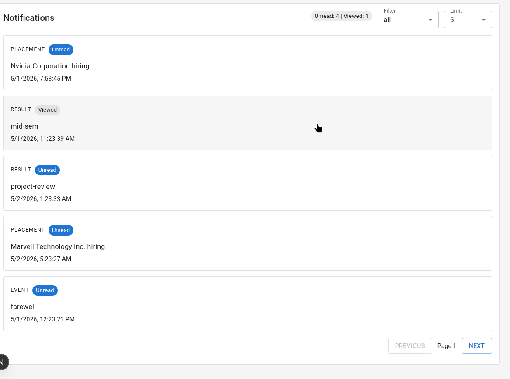
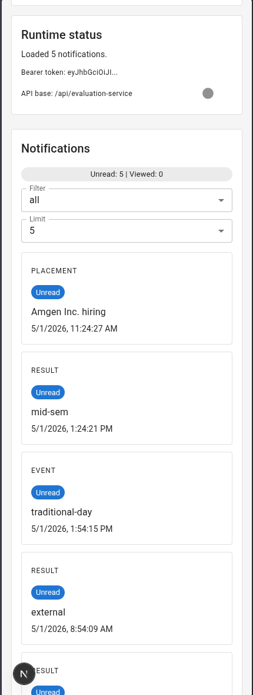
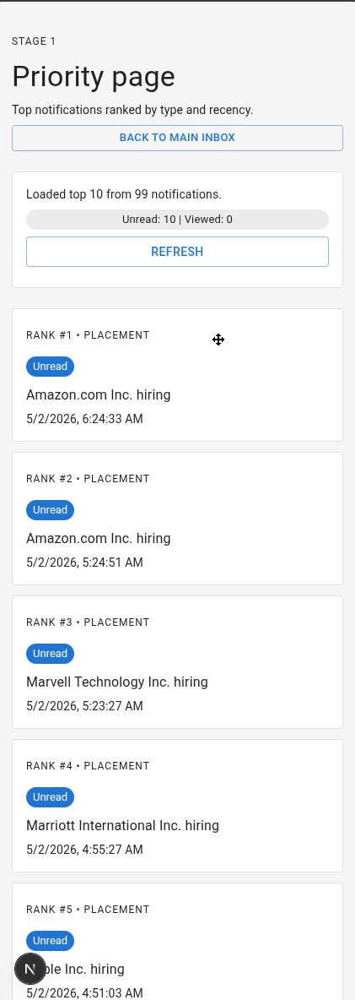

# Notification System Evaluation 

## 🛠 What's inside?

- **`notification_app_fe/`**: Our sleek Next.js frontend where all the action happens.
- **`logging_middleware/`**: A shared utility that keeps our system's vitals in check.
- **`images/`**: A visual tour of the app in action.
- **`notification_system_design.md`**: Our blueprint for how everything works under the hood.

## 📸 App Tour

Explore the interface of our notification system:

### Main Inbox (Desktop)

*A comprehensive view of all notifications with type-based filters and pagination.*

### Priority Inbox (Desktop)

*Our custom ranking algorithm in action, surfacing the most critical updates first.*

### Mobile Experience (Main & Priority)

*A fully responsive design ensuring you never miss an update on the go.*

## 🚦 Getting Started

We've made it easy to get up and running:

1. **Set the stage**: Drop your credentials into `notification_app_fe/.env.local`.
2. **Unlock access**: Head into `notification_app_fe/` and run `npm run pretest:auth`. This magic script handles your registration and grabs your token.
3. **Launch!**: Run `npm run dev` and open [http://localhost:3000](http://localhost:3000).

---

Happy exploring! 🥂
